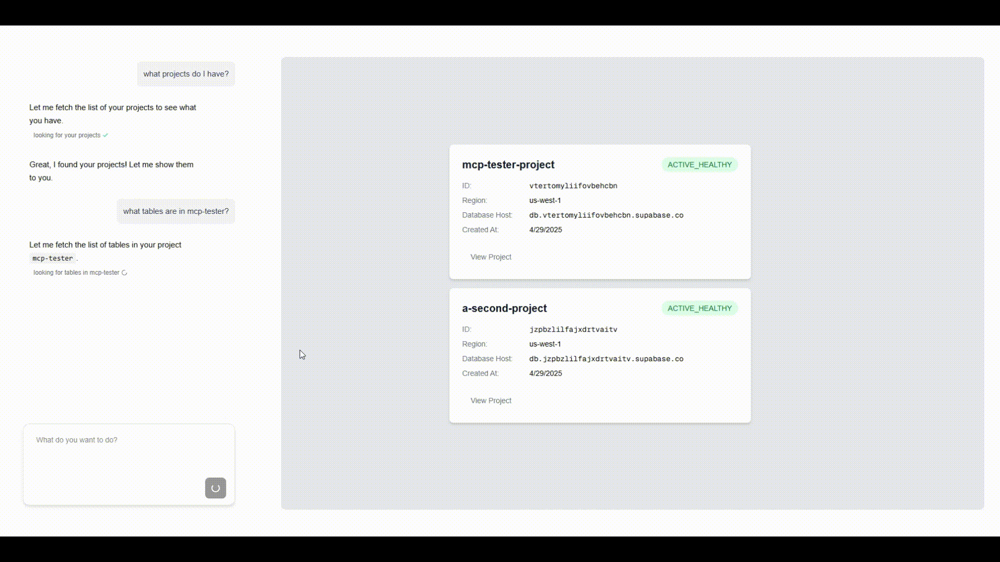

# Supabase MCP Client React App

A NextJS app showing how Supabase MCP tools and UI tools can be added to a React app using [Tambo](https://tambo.co).



[Tambo](https://tambo.co) is a tool that lets you define and register your React components as UI tools that an LLM can use.

[Supabase MCP](https://github.com/supabase-community/supabase-mcp) is an MCP server that provides tool definitions for interacting with Supabase that an LLM can use.

## How it works

- On page load, the app starts a local Supabase MCP server and fetches its tool definitions.
- The app registers the tools with Tambo.
- The app registers components as "UI tools" with Tambo (see `src/lib/tambo.ts`).
- When a message is submitted in the chat, it, along with the combined list of tools and components, is sent to Tambo to decide which tools to call and what text or UI to display.

## Run locally

1. `npm install`

2. Rename `example.env.local` to `.env.local` and add your keys:

- `SUPABASE_ACCESS_TOKEN`: Your Supabase personal access token. You can generate one for your Supabase account here: [https://supabase.com/dashboard/account/tokens](https://supabase.com/dashboard/account/tokens)

- `NEXT_PUBLIC_TAMBO_API_KEY`: Your Tambo API key. You can get a tambo API key for free [here](https://tambo.co/dashboard), or by running `npx tambo init`

Your `.env.local` file should look like this:

```
NEXT_PUBLIC_TAMBO_API_KEY=<your tambo api key>
SUPABASE_ACCESS_TOKEN=<your Supabase personal access token>
```

3. Run `npm run dev` and go to `localhost:3000` to use the app!

## Customizing

### Change what components Tambo can use

The components or "UI tools" that Tambo can use are registered in `src/lib/tambo.ts`.

For example, see how the `supabaseProjectList` component is registered with tambo:

```tsx title="src/lib/tambo.ts"
const components: TamboComponent[] = [
  {
    name: "supabaseProjectList",
    description:
      "A component that displays a list of Supabase projects with their details. Use this when displaying a list of projects.",
    component: ProjectList,
    propsSchema: z.object({
      projects: z
        .array(
          z.object({
            name: z.string().describe("The name of the project"),
            id: z.string().describe("The project ID"),
            region: z
              .string()
              .describe("The region where the project is hosted"),
            status: z.string().describe("The current status of the project"),
            databaseHost: z.string().describe("The database host URL"),
            createdAt: z.string().describe("The creation date of the project"),
          })
        )
        .describe("Array of projects to display"),
    }),
  },
  //...
];
```

Note that the `component` field in the definition is a reference to the actual React component.

This list is passed to the `TamboProvider` component in `src/app/layout.tsx`:

```tsx title="src/app/layout.tsx"
<TamboProvider
  apiKey={process.env.NEXT_PUBLIC_TAMBO_API_KEY!}
  components={components}
>
  {children}
</TamboProvider>
```

Update the `components` array with any component(s) you want Tambo to be able to use in a response.

You can find more information about the component registration options [here.](https://tambo.co/docs/concepts/registering-components)

#
